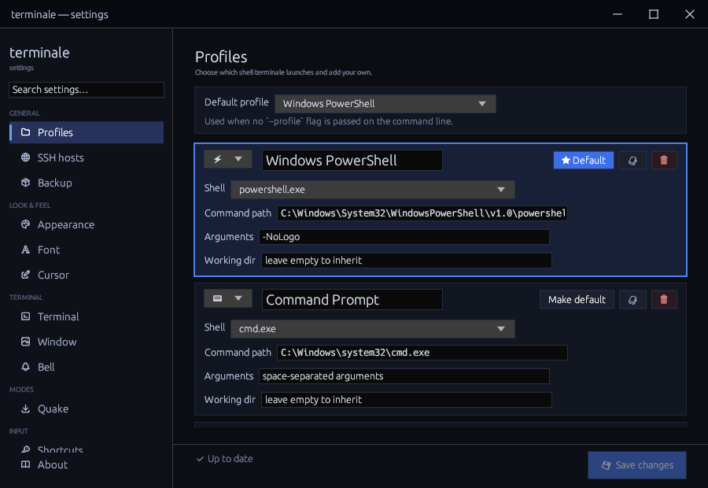
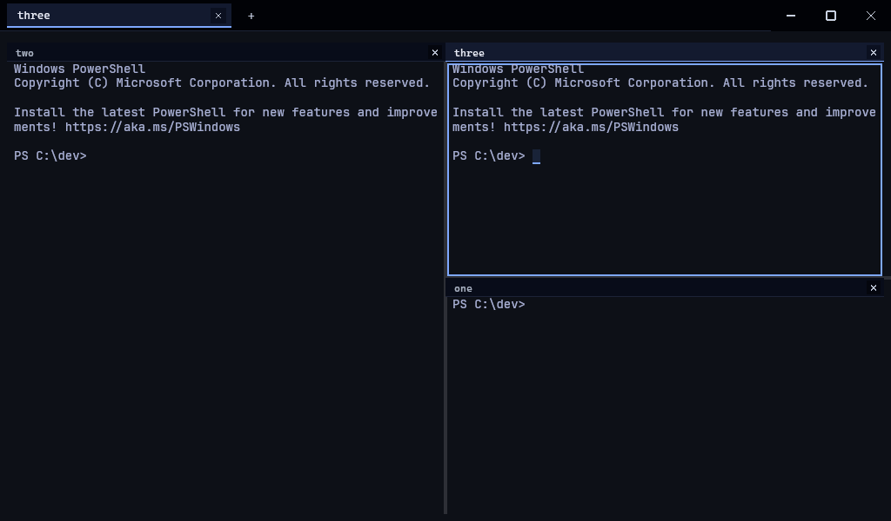
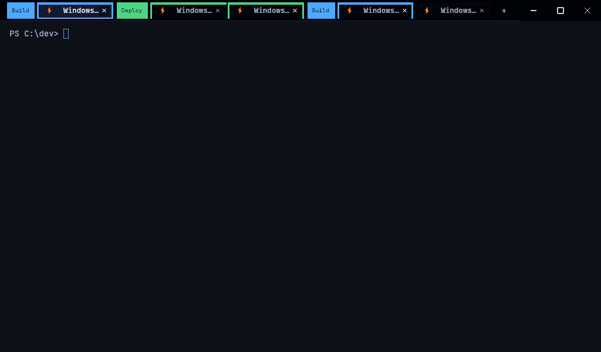
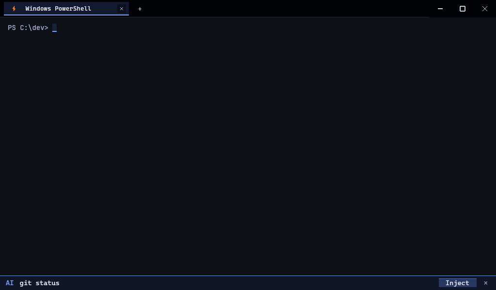

<div align="center">


### the cross-platform terminal that doesn't suck

**Native. GPU-accelerated. Multi-tab. Quake mode. AI inline. Command palette.**

Windows &middot; macOS &middot; Linux — no Electron, no webview, no telemetry.

<br>

[](https://github.com/fbrzlarosa/terminale/actions/workflows/ci.yml)
[](https://codecov.io/gh/fbrzlarosa/terminale)
[](https://github.com/fbrzlarosa/terminale/releases)
[](#license)
[](https://github.com/fbrzlarosa/terminale/discussions)

[](https://www.rust-lang.org)
[](https://wgpu.rs)
[](#install)
[](https://claude.com/claude-code)

A [**stackbyte.dev**](https://stackbyte.dev) project &middot; [stackbyte.dev/terminale](https://stackbyte.dev/terminale) &middot; [hello@stackbyte.dev](mailto:hello@stackbyte.dev)

<sub><b>100% prompt-engineered</b> — every line of this terminal was written by me on <a href="https://claude.com/claude-code">Claude Code</a>, not typed by hand.</sub>

</div>

> **Early but real.** The core and a wide set of UX features work and are
> covered by tests. Star & watch as it grows.

---

## Screenshots

<div align="center">

| The native settings window | Split panes |
|:---:|:---:|
|  |  |
| **Chrome-style tab groups** | **Proactive AI suggestion bar** |
|  |  |

<sub>Captured on Windows. More shots (Quake mode, themes) as features land.</sub>

</div>

---

## Why?

Every terminal makes you pick a side of the same trade-off:

```
  the Electron ones .......... gorgeous, but ~200 MB idle and laggy
  the hyper-minimal ones ..... blazing fast, but no tabs, no plugins
  the power-user ones ........ endless config, dated UX you fight
  the slick modern ones ...... closed-source, account-walled, telemetry
  the deeply-integrated ones . great, but locked to one OS

  terminale .................. fast AND feature-rich AND open AND
                               identical on Windows, macOS and Linux
```

That's the whole pitch: **blazingly fast** *and* **genuinely feature-rich**,
open-source, with a modern dev-focused UX, the same on all three platforms.

The identity is deliberately **retro and colourful** — a pixel-art mark, a
borderless custom title bar, and a wide rainbow of vivid themes (Matrix,
Unicorn, Dracula, Tokyo Night, …). It looks like a terminal from a game that
should exist, with a serious, GPU-accelerated emulator underneath.

---

## Features

A lot already works and is covered by tests. Here's the honest state.

```
  working today
  ---------------------------------------------------------
  [x] cross-platform PTY shell (ConPTY / openpty)
  [x] GPU rendering via wgpu
  [x] multi-tab + reopen-closed-tab
  [x] split panes (horizontal / vertical, nestable)
  [x] proactive AI command-suggestion bar
  [x] command palette + inline AI assistant
  [x] 12 built-in themes + live switching + user themes
  [x] full-scrollback search
  [x] clickable links (OSC 8 / URLs / file:line:col)
  [x] Quake drop-down mode + window snapping
  [x] shell profiles + native settings window
  [x] Lua plugin host (sandboxed)
```

- **Cross-platform PTY shell** — ConPTY on Windows, `openpty` on Unix. One
  codebase, three OSes, same behaviour.
- **GPU rendering** via [`wgpu`](https://wgpu.rs) (Vulkan / Metal / DX12 / GL):
  glyph atlas, ligatures, and a custom borderless title bar.
- **Multi-tab** — new / close / restart, next / previous, move left and right,
  `Ctrl+1..8` jump-to-tab (`Ctrl+9` = last), **reopen closed tab** (restores its
  working directory), and tab titles pulled live from the running program
  (OSC 0/2).
- **Split panes** — split any pane horizontally or vertically, nest the splits
  arbitrarily, focus and swap panes, each with its own title and close button;
  the inactive panes dim so the focused one is obvious.
- **Proactive AI suggestion bar** — a strip pinned to the window bottom that
  reads recent terminal output and asks the configured AI provider for the
  *next* command. Idle-debounced, with a scanning animation while it thinks, and
  an `[INJECT]` button that writes the suggested command to the shell for review
  — never auto-run.
- **Command palette** (`Ctrl+Shift+P`) — fuzzy search over every action.
- **AI assistant** (`Ctrl+Shift+I`) — Claude, OpenAI, or local **Ollama** behind
  one trait. Streamed replies, an *Inject* button that types a suggested command
  into the shell (shell-prompt stripped, never auto-run), and
  **Explain selection** (`Ctrl+Shift+E`).
- **12 built-in themes** + a live theme switcher — Dracula, Matrix, Tokyo Night,
  Catppuccin Latte, and more. [Roll your own](docs/theming.md) in TOML.
- **Full-scrollback search** (`Ctrl+Shift+F`) — scans your whole history, not
  just the visible viewport. Scrollback size is configurable and applied live.
- **Clickable links** — OSC 8 hyperlinks plus auto-detected URLs and
  `file:line:col` paths; Ctrl-click opens the URL or jumps to the path in your
  editor.
- **Quake mode** — a configurable global hotkey shows/hides the terminal,
  always restoring its exact last position and size, with an optional slide
  animation.
- **Window snapping** — snap the focused window to a half, centre it, or maximize
  it on the current monitor (bindable + command palette).
- **Shell profiles** with auto-detection and a picker.
- **Live-applied TOML config** + a native settings window (fonts, cursor,
  opacity, padding, scrollback, bell, themes, AI providers, keybinds).
- **Lua plugins** — a sandboxed Lua 5.4 host with lifecycle hooks and a small
  capability API. [Write one](docs/plugins.md).
- **Solid emulation** (via [`alacritty_terminal`](https://github.com/alacritty/alacritty)):
  true colour, mouse reporting (SGR 1002 / 1003), focus events,
  **paste-jacking-safe** bracketed paste, OSC 52 clipboard, OSC 7
  working-directory, alternate screen, DECSCUSR cursor styles, configurable bell.
- **Crash-resistant** — a panicking tab is isolated and restartable; malformed
  config falls back to defaults instead of taking down your session.

**On the roadmap:** drag-out tab → new window, SSH wired into the UI,
multiplexer + `tmux -CC`, inline images (OSC 1337 / APC / Sixel), shell
integration (OSC 133), richer plugin API, settings sync, auto-update.
Full plan in [`docs/roadmap.md`](docs/roadmap.md).

---

## Install

> Installers for Windows, macOS, and Linux are produced automatically by the
> [release pipeline](.github/workflows/release.yml) on every tagged version.

**One-liner (Linux / macOS)**

```bash
curl --proto '=https' --tlsv1.2 -LsSf \
  https://github.com/fbrzlarosa/terminale/releases/latest/download/terminale-installer.sh | sh
```

**One-liner (Windows PowerShell)** — *recommended for automatic updates*

```powershell
irm https://github.com/fbrzlarosa/terminale/releases/latest/download/terminale-installer.ps1 | iex
```

This installs per-user into `%LOCALAPPDATA%\terminale` (a writable location), so
the in-app updater can replace the binary **silently in the background** and
apply it on the next launch — no UAC prompt, no installer to click through.

**Native installers** — grab the right one from
[Releases](https://github.com/fbrzlarosa/terminale/releases):

| OS | File |
|---|---|
| Windows x86_64 | `terminale-vX.Y.Z-x86_64-pc-windows-msvc.msi` |
| macOS Apple Silicon | `terminale-vX.Y.Z-aarch64-apple-darwin.dmg` |
| macOS Intel | `terminale-vX.Y.Z-x86_64-apple-darwin.dmg` |
| Linux x86_64 | `terminale-vX.Y.Z-x86_64-unknown-linux-gnu.tar.gz` |

> **Windows: the MSI is per-user too (since 0.1.27).** It installs under
> `%LOCALAPPDATA%\terminale` with no admin rights, so the in-app updater
> replaces the binary **silently in the background** — same hands-off updates
> as the PowerShell one-liner, just with a wizard the first time.
>
> **Coming from the old system-wide MSI** (pre-0.1.27, under `Program Files`)?
> Open **Settings → About → "Switch to self-updating install"** — terminale
> reinstalls itself per-user and removes the old copy (one last UAC prompt,
> the last ever). Until you switch, updates still work: the new installer is
> downloaded, verified, and run silently (`/passive`) with a single elevation
> consent — no wizard to click through.

The macOS download is a `.dmg`: open it, then drag **terminale.app** onto the
`/Applications` shortcut. It then shows up in Launchpad and Spotlight with the
app icon and launches as a normal GUI app. (The `…-apple-darwin.tar.gz` is a
bare command-line binary for the `install.sh` / Homebrew paths, not the GUI app.)

> **Opening unsigned builds.** terminale ships **unsigned** (open-source — no paid
> Apple/Windows code-signing certificate). The first launch triggers a one-time
> security prompt. This is expected; here's how to get past it:
>
> - **macOS** — Gatekeeper says *"…cannot be opened because Apple cannot check it
>   for malicious software."* Clear the download quarantine flag, then open:
>   ```sh
>   xattr -d com.apple.quarantine ~/Downloads/terminale-*-apple-darwin.dmg
>   ```
>   Or: try to open it once, then approve it under **System Settings → Privacy &
>   Security → "Open Anyway"**. The **Homebrew** install below sidesteps the prompt.
> - **Windows** — SmartScreen shows *"Windows protected your PC."* Click **"More
>   info" → "Run anyway."**

**Homebrew (macOS + Linux)**

```bash
brew install fbrzlarosa/terminale/terminale
```

**Build from source** — see [`docs/build.md`](docs/build.md) for prerequisites:

```bash
git clone https://github.com/fbrzlarosa/terminale
cd terminale
cargo build --release
./target/release/terminale
```

Want to remove it later? See [`docs/uninstall.md`](docs/uninstall.md).

---

## Quick start

```bash
terminale                          # open with your default shell
terminale --shell /usr/bin/zsh     # pick a shell explicitly
terminale --config ~/custom.toml   # use a custom config file
terminale --quake                  # launch straight into Quake mode (v0.5+)
```

**Default keys**

```
  command palette ...... Ctrl+Shift+P
  AI assistant ......... Ctrl+Shift+I
  explain selection .... Ctrl+Shift+E
  scrollback search .... Ctrl+Shift+F
  new tab .............. Ctrl+T
  jump to tab N ........ Ctrl+1..8   (Ctrl+9 = last)
  quake drop-down ...... Ctrl+`      (global)
```

All of the above are rebindable — see [Configuration](#configuration).

---

## Configuration

`terminale` reads a TOML file from the OS-standard config path (Linux
`~/.config/terminale/config.toml`, macOS
`~/Library/Application Support/terminale/config.toml`, Windows
`%APPDATA%\terminale\config.toml`). Everything can also be changed from the
in-app settings window, and most of it applies **live**:

```toml
[font]
family    = "JetBrains Mono"
size      = 14.0
ligatures = true

[appearance]
theme = "Tokyo Night"          # 12 built-ins: Dracula, Matrix, Catppuccin Latte, ...

[window]
opacity          = 0.97
padding          = 8
scrollback_lines = 10000       # 0 disables scrollback; applied live

[cursor]
style = "block"                # block | outline_block | underline | beam
blink = true

[ai]
default_provider = "ollama"    # claude | openai | ollama

[keybinds]
quake = "Ctrl+`"               # global hotkey for the drop-down terminal
```

Full reference: [`docs/config.md`](docs/config.md). Theme authoring:
[`docs/theming.md`](docs/theming.md). Plugin authoring:
[`docs/plugins.md`](docs/plugins.md).

> **Design rule:** every feature with tunable behaviour has a control in the
> settings window. No dead settings, no behaviour you can only change by editing
> source. That's what makes `terminale` aim to be *more* configurable — never
> less.

---

## Architecture

`terminale` is a Cargo workspace of focused crates:

| Crate | Responsibility |
|---|---|
| `terminale` | The app: window, event loop, tabs, palette, settings UI, suggestion bar |
| `terminale-core` | Shared domain types and glue |
| `terminale-term` | Terminal grid + ANSI engine (wraps `alacritty_terminal`) |
| `terminale-render` | GPU rendering: glyph atlas, background pipeline, pixel font |
| `terminale-ui` | Reusable UI widgets |
| `terminale-config` | TOML schema, defaults, validation, keybinds |
| `terminale-ai` | AI providers (Claude / OpenAI / Ollama) behind one trait |
| `terminale-ssh` | SSH client (`russh`) — exists, not yet wired into the UI |
| `terminale-plugin` | Lua plugin host (`mlua`) |

---

## Contributing

Contributions are welcome! See [`CONTRIBUTING.md`](CONTRIBUTING.md) for setup,
workflow, and project conventions.

- **Commit format**: [Conventional Commits](https://www.conventionalcommits.org/)
- **Test coverage**: at least 75% per crate, enforced in CI
- **Cross-platform**: every change must pass CI on Linux / macOS / Windows

Found a bug? Open an [issue](https://github.com/fbrzlarosa/terminale/issues).
Idea for a feature? Start a [discussion](https://github.com/fbrzlarosa/terminale/discussions).
Security report? See [`SECURITY.md`](SECURITY.md).

---

## License

Licensed under either of **MIT** ([`LICENSE-MIT`](LICENSE-MIT)) or **Apache-2.0**
([`LICENSE-APACHE`](LICENSE-APACHE)), at your option. Unless you explicitly state
otherwise, any contribution intentionally submitted for inclusion shall be
dual-licensed as above, without any additional terms or conditions.

## How it was built

`terminale` is **100% prompt-engineered**: every line — the Rust, the GPU
shaders, the tests, even this README — was written by me on
[**Claude Code**](https://claude.com/claude-code) through prompting, not typed by
hand. It's a real, non-trivial cross-platform GPU application built end-to-end
that way, and a standing experiment in how far disciplined prompt engineering can
take a serious codebase.

## Acknowledgements

Standing on the shoulders of giants:
[`alacritty_terminal`](https://github.com/alacritty/alacritty) (grid + ANSI
engine), [`wgpu`](https://wgpu.rs), [`winit`](https://github.com/rust-windowing/winit),
[`portable-pty`](https://crates.io/crates/portable-pty), and
[`cosmic-text`](https://github.com/pop-os/cosmic-text).

<div align="center">
<br>
<sub>made with rust + a genuine love of pixels &middot; if terminale made your shell less terrible, drop a star</sub>
<br><br>

[stackbyte.dev](https://stackbyte.dev)

</div>
